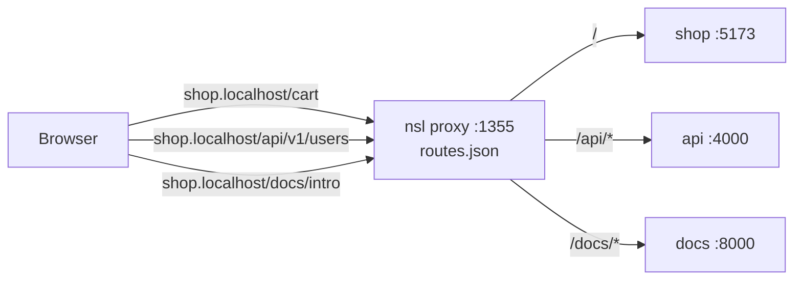

# nsl

[English](./README.md) | [简体中文](./README.zh-CN.md)

One proxy, many apps, no port hunting. `nsl` gives every local service a stable name like `myapp.localhost` — and lets you mount sub-services under the same hostname via path prefixes like `myapp:/api`.

```diff
- $ npm run dev                       # "hm, was this 3000 or 5173 today?"
+ $ nsl run npm run dev               # http://myapp.localhost:1355
```

## Why

A modern dev setup runs a handful of processes — web, API, DB admin, Storybook, maybe a worker. Port numbers are noise: they shuffle on every restart, they leak into bookmarks, and they break the moment a teammate's machine assigns something different. `nsl` fronts them all behind a single proxy port and routes by `(host, path-prefix)`.

- **One URL per service, forever** — `web.localhost`, `api.localhost`. Bookmark them, put them in docs, share them in Slack; the underlying port doesn't matter.
- **Path mounting** — `nsl run --name web:/api` publishes the service as `web.localhost/api/*`. Stack as many as you want under one hostname.
- **Longest-prefix wins** — the proxy picks the most specific route, so `/api/internal` overrides `/api` overrides `/`.
- **Layered config** — system → user → project `nsl.toml` → env vars → flags. No CLI gymnastics for shared settings.
- **HTTPS on demand** — `sudo nsl trust` installs a local CA; per-hostname certs are minted lazily on the first SNI request.
- **Cross-platform** — Linux (x64/arm64), macOS (x64/arm64), Windows (x64). Single prebuilt binary, no runtime deps.

## Install

Via npm (picks the right prebuilt binary for your OS/arch):

```bash
npm i -g @nsio/nsl
```

From source:

```bash
cargo install --path .
```

## Quick start

```bash
cd my-web-app
nsl run npm run dev
# -> http://my-web-app.localhost:1355
```

No config, no flags. `nsl`:

- Infers the app name from `package.json`, the Git root, or the cwd.
- Starts the proxy daemon if it isn't already up.
- Reserves a port from `[app].port_range_start..port_range_end`.
- Registers the route and injects the allocated port into your command.
- Tails output until you Ctrl-C, then removes the route.

Set `NSL=0` or `NSL=skip` to opt out of registration for a single invocation.

## Using `package.json` scripts

```json
{
  "scripts": {
    "dev": "nsl run next dev"
  }
}
```

Commit that once and every contributor gets the same URL for the service.

## Port injection

`nsl run` always exports these environment variables to the child process:

| Variable  | Value |
| --------- | ----- |
| `PORT`    | Allocated app port |
| `HOST`    | `127.0.0.1` |
| `NSL_URL` | Stable proxy URL |

Most frameworks (Next.js, Express, Nuxt, Remix, Hono) already honor `PORT`.

For CLIs that expect explicit port flags, `nsl` can add framework-specific arguments when it recognizes the command:

| Command contains | Added arguments |
| ---------------- | --------------- |
| `vite`, `react-router` | `--port <port> --strictPort --host 127.0.0.1` |
| `astro`, ` ng `, `react-native` | `--port <port> --host 127.0.0.1` |
| `expo` | `--port <port> --host localhost` |

If the command already contains `--port` or `--host`, `nsl` leaves that option alone.

For unknown CLIs that do not read `PORT`, pass the allocated app port with the `NSL_PORT` argument placeholder:

```bash
nsl run ./server --port NSL_PORT
nsl run ./server --addr 127.0.0.1:NSL_PORT
nsl run ./server --listen=127.0.0.1:NSL_PORT
```

`nsl` replaces `NSL_PORT` only in the child command arguments, after it allocates the app port. The `NSL_PORT` environment variable still configures the proxy port.

## How it works

The proxy routes each request by two keys: **the hostname** (minus any configured domain suffix) and **the longest matching path prefix**. That simple model gives you subdomain-per-service *and* path-mounted sub-services at the same time.

```bash
# One hostname, three services, three commands:
nsl run --name shop            npm run web       # shop:/       -> :5173
nsl run --name shop:/api       npm run api       # shop:/api/*  -> :4000
nsl run --name shop:/docs      npm run docs      # shop:/docs/* -> :8000
```



The matcher is greedy on the prefix:

| Request path            | Matches route       | Routed to |
| ----------------------- | ------------------- | --------- |
| `/cart`                 | `shop:/`            | `:5173`   |
| `/api`                  | `shop:/api`         | `:4000`   |
| `/api/v1/users`         | `shop:/api`         | `:4000`   |
| `/api/internal/trace`   | `shop:/api/internal`| (most specific wins) |
| `/docs/intro`           | `shop:/docs`        | `:8000`   |

`--strip` removes the matched prefix before forwarding (`/api/users` → `/users`). Handy when a backend doesn't know it lives under `/api`.

## Cross-domain matching

Register a route as `shop.localhost` and `nsl` will also serve it as `shop.dev.local` — as long as both suffixes are in `[proxy].domains`. Matching happens on the leading label, so one route works across every domain you list:

```toml
[proxy]
domains = ["localhost", "dev.local", "test"]
```

For suffixes that don't auto-resolve like `.localhost` does, run `sudo nsl hosts sync` to drop entries into `/etc/hosts` (inside `# nsl-start` / `# nsl-end` markers), or point a local dnsmasq at `127.0.0.1`.

## HTTPS

For features that require a secure context (Service Workers, Secure cookies, `crypto.subtle`), terminate TLS at the proxy:

```bash
sudo nsl trust          # install the local CA (once per machine)
nsl start --https
```

The CA is generated on first run and trusted on macOS (Keychain), Linux (`update-ca-certificates` / NSS), and Windows (`certutil`). Firefox keeps its own trust store — import the CA manually there. Per-hostname leaf certs are generated on demand from the first SNI handshake and cached under `certs/`.

## Commands

```
nsl run [FLAGS] <CMD>...       Launch a process behind a proxied route.
nsl start [FLAGS]              Start the proxy daemon.
nsl stop                       Stop the proxy daemon.
nsl reload                     Stop + start, re-reading config.
nsl logs [-n N] [--follow]     Print daemon log.
nsl status                     Daemon state + routes + effective config.
nsl list                       Active routes only.
nsl route [NAME[:/PATH]] [PORT]   Register/remove a static route.
nsl get <NAME[:/PATH]>         Print the URL for a name (for CI / scripts).
nsl trust                      Install the local CA into the trust store.
nsl hosts sync | clean         Sync route hostnames to /etc/hosts.
```

### `nsl run` flags

| Flag                      | Description                                               |
| ------------------------- | --------------------------------------------------------- |
| `-n, --name NAME[:/PATH]` | Override the inferred name (and optional path prefix).    |
| `-p, --port N`            | Pin the child to a fixed port.                            |
| `-s, --strip`             | Strip the matched prefix before forwarding.               |
| `-c, --change-origin`     | Rewrite the outgoing `Host` header to the target address. |
| `--force`                 | Take over a route currently held by another process.      |

### `nsl start` flags

| Flag             | Description                                        |
| ---------------- | -------------------------------------------------- |
| `--port N`       | Override `[proxy].port` (default `1355`).          |
| `--bind ADDR`    | Override `[proxy].bind` (e.g. `0.0.0.0` for LAN).  |
| `--https`        | Terminate TLS at the proxy.                        |
| `--foreground`   | Stay in the current shell instead of daemonizing.  |

### Static routes for non-`nsl` processes

`nsl route` registers a route for something you didn't start through `nsl` — a Docker container, a compiled binary, a service on another host.

```bash
nsl route api 3001              # api:/ -> :3001
nsl route api:/v1 3001 --strip  # strip /v1 before forwarding
nsl route api --remove
```

> **Reserved words:** `run`, `start`, `stop`, `reload`, `logs`, `route`, `get`, `list`, `status`, `trust`, `hosts`. Use `nsl run --name <name> <cmd>` if a reserved word collides with your project name.

## Configuration

Merged lowest → highest:

1. `/etc/nsl/config.toml` (system)
2. `~/.nsl/config.toml` (user)
3. Nearest `./nsl.toml` walking up from cwd (project)
4. `NSL_*` environment variables
5. CLI flags

Full template in [`config.example.toml`](./config.example.toml). Minimal:

```toml
[proxy]
port = 1355
bind = "127.0.0.1"
https = false
domains = ["localhost", "dev.local"]
# max_hops = 5   # loop-detection cap

# Override URL display when an external reverse proxy fronts this domain.
# (Affects `nsl get` / `nsl status` output only; doesn't change routing.)
[proxy.domain."dev.example.com"]
https = true
# port = 443

[app]
port_range_start = 3000
port_range_end   = 9999

[paths]
# state_dir = "/absolute/path/to/nsl-state"
```

### Environment

| Variable        | Purpose                                 |
| --------------- | --------------------------------------- |
| `NSL_PORT`      | Proxy port.                             |
| `NSL_HTTPS`     | `1` / `true` enables HTTPS.             |
| `NSL_BIND`      | Bind address (e.g. `0.0.0.0`).          |
| `NSL_DOMAINS`   | Comma-separated allowed domain suffixes.|
| `NSL_STATE_DIR` | Override the state directory.           |

`nsl run` also exports `PORT`, `HOST`, `NSL_URL`, and `NSL=1` into the child process.

### State directory

| Scenario                          | Location                                      |
| --------------------------------- | --------------------------------------------- |
| Non-privileged proxy port (Unix)  | `~/.nsl`                                      |
| Privileged proxy port (Unix)      | `/tmp/nsl`                                    |
| Non-privileged proxy port (Windows)| `%USERPROFILE%\.nsl`                         |
| Privileged proxy port (Windows)   | `%LOCALAPPDATA%\nsl`                          |
| Override                          | `NSL_STATE_DIR=/abs/path`                     |

Contents:

| File          | Purpose                                   |
| ------------- | ----------------------------------------- |
| `routes.json` | Persisted routes (shared between CLI + daemon). |
| `proxy.pid`   | Daemon PID.                               |
| `proxy.port`  | Port the daemon actually bound.           |
| `proxy.log`   | Daemon stdout/stderr.                     |
| `certs/`      | CA + per-hostname leaf certs.             |

## Chaining nsl apps

If a dev server upstream-proxies to another `nsl`-backed service, set `changeOrigin: true` on that proxy so the `Host` header matches the target. Otherwise the request lands back at the source app and the chain loops.

```ts
// vite.config.ts
server: {
  proxy: {
    "/api": { target: "http://api.localhost:1355", changeOrigin: true, ws: true },
  },
}
```

`nsl` tags every forwarded request with `x-nsl-hops`. Once it exceeds `[proxy].max_hops` (default `5`) the proxy short-circuits with a branded `508 Loop Detected` page — so you see the misconfiguration instead of a hung request.

## Notes per framework

- **Next.js 15+** adds a dev-time origin guard. Add your hostnames to `allowedDevOrigins` in `next.config.js`:

  ```js
  module.exports = {
    allowedDevOrigins: ["*.localhost", "*.dev.local"],
  };
  ```

- **Vite / webpack** — see [Chaining nsl apps](#chaining-nsl-apps) above.
- **Safari / any non-Chromium browser** that doesn't auto-resolve `*.localhost` — run `sudo nsl hosts sync` once per domain suffix, or use `.test` / `.dev.local` with a local dnsmasq.

## Uninstall / reset

```bash
nsl stop
sudo nsl hosts clean      # if you ever ran `nsl hosts sync`
rm -rf ~/.nsl             # CA, routes, logs
sudo rm -rf /tmp/nsl      # only if you ran the proxy on a privileged port
npm uninstall -g @nsio/nsl
```

If you plan to use HTTPS again afterward, re-run `sudo nsl trust` — the old CA was wiped with the state directory.

## Troubleshooting

- **"proxy is not running"** after `nsl route` — `nsl run` auto-starts the proxy, but `nsl route` does not. Run `nsl start` once.
- **Port already in use** — something else holds `1355`. Change with `nsl start --port 8080` or `[proxy].port = 8080`.
- **`.localhost` doesn't resolve on Linux** — glibc resolves `*.localhost` by default, but a few minimal distros strip the rule. Either restore it in `/etc/nsswitch.conf` or switch to `sudo nsl hosts sync` with a custom suffix.
- **Browser says the HTTPS cert isn't trusted** — run `sudo nsl trust`. For Firefox on Linux, import the CA manually (Firefox uses its own NSS database).
- **WebSocket / HTTP/2** — transparently upgraded; no special flag.

## Acknowledgements

The subdomain routing model is inspired by [vercel-labs/portless](https://github.com/vercel-labs/portless). `nsl` rewrites it in Rust and extends it with path-prefix mounting, longest-prefix matching, cross-domain aliasing, and a TOML config hierarchy.

## License

Apache-2.0. See [LICENSE](./LICENSE).
