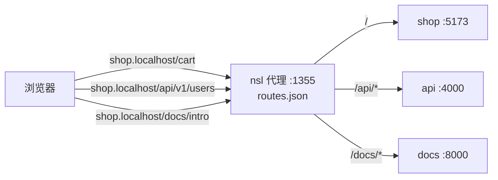

# nsl

[English](./README.md) | [简体中文](./README.zh-CN.md)

一个代理、多个应用、永不找端口。`nsl` 把每个本地服务挂到固定名字上(如 `myapp.localhost`),并通过路径前缀(如 `myapp:/api`)让多个子服务共享同一个主机名。

```diff
- $ npm run dev                       # "这个今天是 3000 还是 5173?"
+ $ nsl run npm run dev               # http://myapp.localhost:1355
```

## 为什么需要它

现代开发环境跑一堆进程 —— web、API、DB 面板、Storybook、可能还有后台 worker。端口号是噪音:每次重启可能漂移、会漏进书签和文档、别人的机器上分到不同端口就炸。`nsl` 在一个固定代理端口后面按 `(主机名, 路径前缀)` 路由。

- **每个服务一个稳定 URL** —— `web.localhost`、`api.localhost`。放进书签、文档、Slack 都可以,后面是哪个端口根本不重要。
- **路径挂载** —— `nsl run --name web:/api` 把服务发布在 `web.localhost/api/*` 上,爱挂多少挂多少。
- **最长前缀胜出** —— 代理挑最具体的那条,`/api/internal` 优先于 `/api` 优先于 `/`。
- **分层配置** —— 系统 → 用户 → 项目 `nsl.toml` → 环境变量 → CLI 参数。共享配置不靠堆 CLI 参数。
- **按需 HTTPS** —— `sudo nsl trust` 装一次本地 CA;每个 hostname 的证书在首次 SNI 时按需签发。
- **跨平台** —— Linux(x64/arm64)、macOS(x64/arm64)、Windows(x64),单一预编译二进制,无运行时依赖。

## 安装

走 npm(按你的 OS/arch 自动拉预编译二进制):

```bash
npm i -g @nsio/nsl
```

从源码构建:

```bash
cargo install --path .
```

## 快速开始

```bash
cd my-web-app
nsl run npm run dev
# -> http://my-web-app.localhost:1355
```

零配置、零参数。`nsl` 会:

- 从 `package.json`、Git 根目录或当前目录推断应用名。
- 如果代理守护进程没在跑,自动启动。
- 从 `[app].port_range_start..port_range_end` 挑一个空闲端口。
- 注册路由并把分配到的端口注入子进程。
- 跟随输出直到 Ctrl-C,然后清理路由。

想让某次调用跳过注册,设 `NSL=0` 或 `NSL=skip`。

## 在 `package.json` 里用

```json
{
  "scripts": {
    "dev": "nsl run next dev"
  }
}
```

提交一次,所有协作者都用同一个 URL。

## 应用启动全流程

`nsl run [参数] <命令>...` 会按这个顺序把应用接到代理后面:

1. 从系统、用户、项目、环境变量、CLI 参数加载并合并配置。
2. 从 `--name`、`package.json`、Git 根目录或当前目录解析路由名和可选路径前缀。
3. 如果代理守护进程没在运行,先启动代理。自动启动时使用 `[proxy].listen` 和 `NSL_LISTEN`;`--listen` 用于显式执行 `nsl start` 或 `nsl reload`。
4. 从 `[app].port_range_start..port_range_end` 里挑应用端口,除非 `--port` 指定了固定端口。
5. 准备子进程环境变量: `PORT`、`HOST`、`NSL_URL`、`NSL=1`。
6. 替换子命令参数里的 `NSL_PORT` 字面量,然后按识别到的框架追加端口参数。
7. 把路由写入 `routes.json`,包括路径前缀、`--strip`、`--change-origin` 选项。
8. 启动子命令,等待应用端口可连接,然后输出稳定 URL。
9. 持续转发输出直到子进程退出或你按 Ctrl-C,最后移除路由。

`nsl route` 是给已运行服务用的手动路径。它不管理子进程,只写入或删除路由。

## 自动推断名称

没有传 `--name` 时,`nsl run` 会从当前目录上下文推断路由名:

1. 从当前目录向上查找最近的 `package.json` `name` 字段。带 scope 的包名会去掉 scope:`@scope/shop` 变成 `shop`。
2. Git 仓库根目录名。
3. 当前目录名;如果目录名不可用,退回 `app`。

选中的值会清理成合法 hostname label。在 Git multi-worktree 里,非默认分支还会把分支最后一段清理后加到前面。例如分支 `feature/login` 加 package `shop` 会得到 `login-shop.localhost`。

如果你需要不受目录、package 元数据或分支影响的固定名称,使用 `--name NAME`。

## 端口注入

`nsl run` 总会给子进程注入这些环境变量:

| 变量      | 值 |
| --------- | --- |
| `PORT`    | 自动分配的应用端口 |
| `HOST`    | `127.0.0.1` |
| `NSL_URL` | 稳定代理 URL |
| `NSL`     | `1` |

大部分框架(Next.js、Express、Nuxt、Remix、Hono)自动识别 `PORT`。

对需要显式端口参数的 CLI,`nsl` 识别到部分框架命令后会自动追加参数:

| 命令包含 | 追加参数 |
| -------- | -------- |
| `vite`、`react-router` | `--port <port> --strictPort --host 127.0.0.1` |
| `astro`、` ng `、`react-native` | `--port <port> --host 127.0.0.1` |
| `expo` | `--port <port> --host localhost` |

如果命令里已经有 `--port` 或 `--host`,`nsl` 不会覆盖该参数。

对不读取 `PORT` 的未知 CLI,用 `NSL_PORT` 参数占位符传入自动分配的应用端口:

```bash
nsl run ./server --port NSL_PORT
nsl run ./server --addr 127.0.0.1:NSL_PORT
nsl run ./server --listen=127.0.0.1:NSL_PORT
```

`nsl` 会在分配应用端口后,只替换子命令参数里的 `NSL_PORT` 字面量。

## 工作原理

代理用两个键匹配请求:**主机名**(去掉配置里的域名后缀)和**最长匹配的路径前缀**。这个简单模型同时给你子域名和路径挂载两种能力。

```bash
# 一个主机名,三个服务,三条命令:
nsl run --name shop            npm run web       # shop:/       -> :5173
nsl run --name shop:/api       npm run api       # shop:/api/*  -> :4000
nsl run --name shop:/docs      npm run docs      # shop:/docs/* -> :8000
nsl run --name shop:/api --strip npm run api     # 上游收到 /users 而不是 /api/users
```



前缀匹配是贪心的:

| 请求路径                | 命中路由            | 转发到    |
| ----------------------- | ------------------- | --------- |
| `/cart`                 | `shop:/`            | `:5173`   |
| `/api`                  | `shop:/api`         | `:4000`   |
| `/api/v1/users`         | `shop:/api`         | `:4000`   |
| `/api/internal/trace`   | `shop:/api/internal`| (更具体的那条) |
| `/docs/intro`           | `shop:/docs`        | `:8000`   |

`--strip` 在转发前剥掉匹配到的前缀(`/api/users` → `/users`)。后端不知道自己挂在 `/api` 下的时候很有用。

## 跨域名匹配

路由注册为 `shop.localhost`,`nsl` 也会把 `shop.dev.local` 解析到同一条路由 —— 只要两个后缀都在 `[proxy].domains` 里。匹配发生在最前面那段标签,一条路由覆盖所有列出的域名:

```toml
[proxy]
domains = ["localhost", "dev.local", "test"]
```

像 `.localhost` 一样自动解析的后缀不多。其他后缀,跑 `sudo nsl hosts sync` 把条目写进 `/etc/hosts`(放在 `# nsl-start` / `# nsl-end` 标记之间),或者配个本地 dnsmasq 指向 `127.0.0.1`。

## HTTPS

需要 Secure Context 的功能(Service Worker、Secure Cookie、`crypto.subtle`),让代理终结 TLS:

```bash
sudo nsl trust          # 安装本地 CA(每台机器一次)
nsl start --https
```

CA 在第一次启动时生成,自动信任 macOS(Keychain)、Linux(`update-ca-certificates` / NSS)、Windows(`certutil`)的系统信任库。Firefox 用自己的信任库,需要手动导入。每个 hostname 的叶子证书在第一次 SNI 握手时按需生成,缓存在 `certs/` 里。

## 命令一览

```
nsl run [FLAGS] <CMD>...       以代理路由方式启动进程。
nsl start [FLAGS]              启动代理守护进程。
nsl stop                       停止代理守护进程。
nsl reload                     先停后启,重新读配置。
nsl logs [-n N] [--follow]     打印守护日志。
nsl status                     守护状态 + 路由 + 生效配置。
nsl list                       仅活跃路由。
nsl route [NAME[:/PATH]] [PORT]   注册/移除静态路由。
nsl get <NAME[:/PATH]>         打印名字对应的 URL(CI / 脚本用)。
nsl trust                      安装本地 CA 到系统信任库。
nsl hosts sync | clean         同步路由主机名到 /etc/hosts。
```

### `nsl run` 参数

| 参数                      | 说明                                                    |
| ------------------------- | ------------------------------------------------------- |
| `-n, --name NAME[:/PATH]` | 覆盖自动推断的名字(可带路径前缀)。                    |
| `-p, --port N`            | 把子进程钉到固定端口。                                  |
| `-s, --strip`             | 转发前剥掉匹配到的前缀。                                |
| `-c, --change-origin`     | 把外发请求的 `Host` 头改写为目标地址。                  |
| `-f, --force`             | 抢走别的进程正在占着的同名路由。                        |

### `nsl start` 参数

| 参数             | 说明                                              |
| ---------------- | ------------------------------------------------- |
| `--listen ADDR`  | 覆盖 `[proxy].listen`(如 `127.0.0.1:1355` 或 `:1355`)。 |
| `--https`        | 代理层终结 TLS。                                  |
| `--foreground`   | 前台运行,不守护化。                              |

从脚本启动或重载代理时,也可以用 `NSL_LISTEN=ADDR`:

```bash
NSL_LISTEN=127.0.0.1:1355 nsl start
NSL_LISTEN=:1355 nsl reload
```

### 代理日志

`nsl logs` 读取代理守护进程日志,位置是 `state_dir/proxy.log`。

```bash
nsl logs
nsl logs -n 100
nsl logs --follow
```

`nsl run` 的应用输出只转发到当前终端,`nsl` 不持久化应用日志。

### 给非 `nsl` 启动的进程注册路由

`nsl route` 给不是通过 `nsl` 启动的东西注册路由 —— Docker 容器、编译好的二进制、跑在别的机器上的服务。

```bash
nsl route api 3001              # api:/ -> :3001
nsl route api:/v1 3001 --strip  # 转发前剥掉 /v1
nsl route api --remove
```

`NAME:/PATH` 会把目标服务挂到同一个主机名的路径前缀下。上游服务只认识根路径时加
`--strip`: `/v1/users` 会以 `/users` 转发给目标服务。

| 参数                  | 说明                                      |
| --------------------- | ----------------------------------------- |
| `--remove`            | 移除路由。                                |
| `-f, --force`         | 替换已有路由。                            |
| `-s, --strip`         | 转发前剥掉匹配到的路径前缀。              |
| `-c, --change-origin` | 把外发请求的 `Host` 头改写为目标地址。    |

> **保留字:** `run`、`start`、`stop`、`reload`、`logs`、`route`、`get`、`list`、`status`、`trust`、`hosts`。项目名不巧撞到保留字,用 `nsl run --name <name> <cmd>`。

## 配置

配置分为三个作用域:

- **代理作用域**(`[proxy]`)控制前置代理本身:监听地址、HTTPS、允许的域名后缀、URL 显示方式。
- **应用作用域**(`[app]`)控制 `nsl run` 如何给子进程分配端口。
- **状态作用域**(`[paths]`)控制路由、日志、PID 文件、证书等运行时状态保存在哪里。

配置按优先级从低到高合并:

1. `/etc/nsl/config.toml`(系统)
2. `~/.nsl/config.toml`(用户)
3. 最近的 `./nsl.toml`(从当前目录向上查找)(项目)
4. `NSL_*` 环境变量
5. CLI 参数

完整模板见 [`config.example.toml`](./config.example.toml)。

### 最小配置

```toml
[proxy]
listen = "127.0.0.1:1355"
https = false
domains = ["localhost", "dev.local"]
# max_hops = 5   # 循环检测上限

# 域名被外部反向代理托管时,覆盖 URL 显示
#(仅影响 `nsl get` / `nsl status` 的输出,不影响路由)
[proxy.display."dev.example.com"]
https = true
# port = 443

[app]
port_range_start = 3000
port_range_end   = 9999

[paths]
# state_dir = "/absolute/path/to/nsl-state"
```

### 代理配置

`[proxy].listen` 配置的是代理自己的监听地址。它和 `nsl run` 分配给子进程的应用端口是两回事。

```toml
[proxy]
listen = "127.0.0.1:1355"  # 只监听本机回环地址
# listen = ":1355"         # 监听全部 IPv4 网卡
https = false
domains = ["localhost", "dev.local"]
```

启动或重载代理时可以用 CLI 参数或环境变量覆盖:

```bash
nsl start --listen 127.0.0.1:8080
NSL_LISTEN=:1355 nsl reload
```

`[proxy].domains` 控制代理识别哪些域名后缀。`.localhost` 通常自动解析。其他后缀一般需要 `sudo nsl hosts sync` 或本地 DNS。

域名显示覆盖只影响 `nsl get` 和 `nsl status` 生成的 URL,不改变路由匹配:

```toml
[proxy.display."dev.example.com"]
https = true
port = 443
```

### 应用配置

`[app]` 控制 `nsl run` 使用的应用端口池。

```toml
[app]
port_range_start = 3000
port_range_end = 9999
```

每次 `nsl run` 选出的应用端口都会通过 `PORT` 传给子进程,也可以用 `NSL_PORT` 字面量插入到子命令参数里。只有子进程必须固定端口时才使用 `nsl run --port N`。

### 环境变量

| 变量            | 作用                                |
| --------------- | ----------------------------------- |
| `NSL_LISTEN`    | 代理监听地址(如 `127.0.0.1:1355` 或 `:1355`)。 |
| `NSL_HTTPS`     | `1` / `true` 启用 HTTPS。           |
| `NSL_DOMAINS`   | 逗号分隔的允许域名后缀。            |
| `NSL_STATE_DIR` | 覆盖状态目录。                      |

`nsl run` 还会给子进程注入 `PORT`、`HOST`、`NSL_URL` 和 `NSL=1`。

### 状态目录

| 场景                             | 路径                                          |
| -------------------------------- | --------------------------------------------- |
| 非特权代理端口(Unix)            | `~/.nsl`                                      |
| 特权代理端口(Unix)              | `/tmp/nsl`                                    |
| 非特权代理端口(Windows)         | `%USERPROFILE%\.nsl`                          |
| 特权代理端口(Windows)           | `%LOCALAPPDATA%\nsl`                          |
| 手动覆盖                         | `NSL_STATE_DIR=/abs/path`                     |

内容:

| 文件          | 作用                                       |
| ------------- | ------------------------------------------ |
| `routes.json` | 持久化路由(CLI 和守护进程共享)。         |
| `proxy.pid`   | 守护进程 PID。                             |
| `proxy.port`  | 守护进程实际绑定的端口。                   |
| `proxy.log`   | 守护进程 stdout/stderr。                   |
| `certs/`      | CA + 每主机名叶子证书。                    |

## nsl 应用链式代理

如果你的开发服务器把请求上游代理到另一个 `nsl` 服务,**记得**在上游代理里设 `changeOrigin: true`,让 `Host` 头匹配目标。否则请求会被路由回源应用,形成循环。

```ts
// vite.config.ts
server: {
  proxy: {
    "/api": { target: "http://api.localhost:1355", changeOrigin: true, ws: true },
  },
}
```

每个转发请求会打上 `x-nsl-hops` 头。一旦超过 `[proxy].max_hops`(默认 `5`),代理直接短路返回定制的 `508 Loop Detected` 页 —— 你能看见错误,而不是请求卡死。

## 按框架的说明

- **Next.js 15+** 加了开发期 origin 保护,把主机名加到 `next.config.js` 的 `allowedDevOrigins`:

  ```js
  module.exports = {
    allowedDevOrigins: ["*.localhost", "*.dev.local"],
  };
  ```

- **Vite / webpack** —— 见上面的[链式代理](#nsl-应用链式代理)。
- **Safari / 其他不自动解析 `*.localhost` 的浏览器** —— 每个域名后缀跑一次 `sudo nsl hosts sync`,或者用 `.test` / `.dev.local` 配 dnsmasq。

## 卸载 / 重置

```bash
nsl stop
sudo nsl hosts clean      # 如果跑过 nsl hosts sync
rm -rf ~/.nsl             # CA、路由、日志
sudo rm -rf /tmp/nsl      # 仅在用过特权端口时
npm uninstall -g @nsio/nsl
```

如果之后还要用 HTTPS,重新 `sudo nsl trust` —— 旧 CA 跟状态目录一起没了。

## 常见问题

- **`nsl route` 报 "proxy is not running"** —— `nsl run` 会自动启动,但 `nsl route` 不会。先跑一次 `nsl start`。
- **端口被占用** —— 别的进程占了 `1355`。改用 `nsl start --listen 127.0.0.1:8080` 或在配置里设 `[proxy].listen = "127.0.0.1:8080"`。
- **Linux 上 `.localhost` 解析失败** —— glibc 默认支持 `*.localhost`,某些极简发行版裁掉了。要么在 `/etc/nsswitch.conf` 里补上,要么改用自定义域名后缀 + `sudo nsl hosts sync`。
- **浏览器说 HTTPS 证书不受信任** —— 跑 `sudo nsl trust`。Linux 上的 Firefox 用自己的 NSS 信任库,手动导入 CA。
- **WebSocket / HTTP/2** —— 透明升级,不需要额外参数。

## 致敬

子域名路由的思路来自 [vercel-labs/portless](https://github.com/vercel-labs/portless)。`nsl` 用 Rust 重写,并扩展了路径前缀挂载、最长前缀匹配、跨域名别名和 TOML 配置层级。

## 许可证

Apache-2.0,详见 [LICENSE](./LICENSE)。
